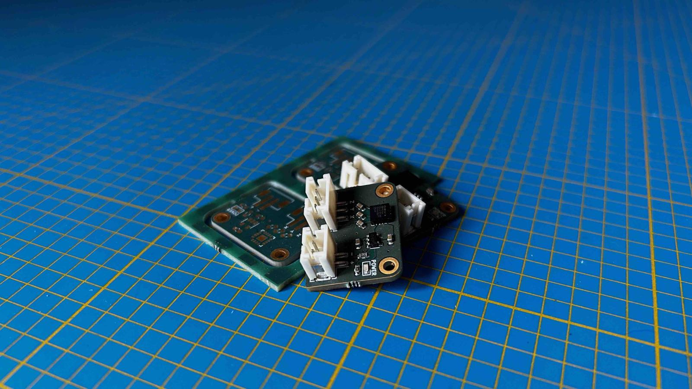

# ADXL335

Here is the repository of one of my electronic projects, a rather simple electronic card around a MEMS accelerometer: ADXL335. MEMS accelerometers are compact devices that exploit microfabrication technology to integrate mechanical elements, sensors, actuators, and electronics on a tiny silicon chip. At the core of these devices lies a MEMS structure, often composed of microstructures such as beams or cantilevers, which respond to external forces.

This entire project is documented on my [personal website](https://albanpetit.com/posts/adxl-335-accelerometer/), from the electronic card to the code necessary for its operation, including its manufacturing itself. 

## Contribution

If you're interested in contributing to my website, i'd love to have your input. Here's how you can get started:

Fork the Repository: Click on the "Fork" button at the top right of this repository to create your own copy.
Clone Your Fork: Clone your forked repository to your local machine using the following command:
git clone https://github.com/albanpetit/albanpetit.com
Create a New Branch: Switch to a new branch for your contributions.
git checkout -b feature/your-feature-name
Make Changes: Make the necessary changes or additions to improve the website.
Commit Your Changes: Commit your changes with descriptive commit messages.
git commit -m "feat: description of the new feature"
Push to Your Fork: Push your changes to your forked repository.
git push origin feature/your-feature-name
Open a Pull Request: Once you've pushed your changes to your fork, open a pull request in our repository. Provide a detailed description of your changes and any relevant information.

### Commit naming convention

To make the commit history as readable as possible, I try to adhere as closely as I can to the following naming convention :

<type> <sujet>

<description>
Type defines the type of commit
build: build solution (gulp, webpack, npm)
ci: Continuous integration (Travis, Circle, BrowserStack, SauceLabs)
git: gitignore modification. submodule update, merging
docs: Documentation
feat: Add feature
fix: bug fix
perf: Performance improvement
refactor: Code changement which does not change the usage
style: Style modification
test: Tests modification
Sujet contains a brief description of the changes Using the present imperative ("change", not "changed" or "changes") Without capital letter at the beginning No "." at the end of the description
Description allows to detail in more detail the motivations behind the change. The rules are the same as for the Subject part.
I invite you to follow this convention to contribute more easily to this repository.

### Feedback and Issues

If you encounter any issues, have suggestions, or want to discuss new features, please open an issue on the GitHub repository. Your feedback is highly valued!

Thank you for considering contributing to my website.